### 扩展任务2

购物车底部要有一个推荐商品，请调研相关资料，实现一个推荐商品功能（协同过滤算法）

## 1.协同过滤算法介绍

CF算法分为两大类，一类为基于memory的（Memory-based），另一类为基于Model的（Model-based），最常用的**User-base**d和**Item-based**算法均属于Memory-based类型，具体细分类可以参考wikipedia的说明。

### User-based

User-based的基本思想是如果用户A喜欢物品a，用户B喜欢物品a、b、c，用户C喜欢a和c，那么认为用户A与用户B和C相似，因为他们都喜欢a，而喜欢a的用户同时也喜欢c，所以把c推荐给用户A。该算法用最近邻居（nearest-neighbor）算法找出一个用户的邻居集合，该集合的用户和该用户有相似的喜好，算法根据邻居的偏好对该用户进行预测。
User-based算法存在两个重大问题：

**1.数据稀疏性。**一个大型的电子商务推荐系统一般有非常多的物品，用户可能买的其中不到1%的物品，不同用户之间买的物品重叠性较低，导致算法无法找到一个用户的邻居，即偏好相似的用户。
**2.算法扩展性。**最近邻居算法的计算量随着用户和物品数量的增加而增加，不适合数据量大的情况使用。

### Item-based

Item-based的基本思想是预先根据所有用户的历史偏好数据计算物品之间的相似性，然后把与用户喜欢的物品相类似的物品推荐给用户。还是以之前的例子为例，可以知道物品a和c非常相似，因为喜欢a的用户同时也喜欢c，而用户A喜欢a，所以把c推荐给用户A。
因为物品直接的相似性相对比较固定，所以可以预先在线下计算好不同物品之间的相似度，把结果存在表中，当推荐时进行查表，计算用户可能的打分值，可以同时解决上面两个问题。

**因此在本次扩展任务中，我们选择使用Item—based算法**

## 2.数据库搭建

这里，我搭建了一个数据库进行demo模拟。在这里，我们**扮演用户A**，对一些商品进行选购后，点击推荐按钮，系统会从上到下推荐一些商品（按用户A可能的喜好排序）

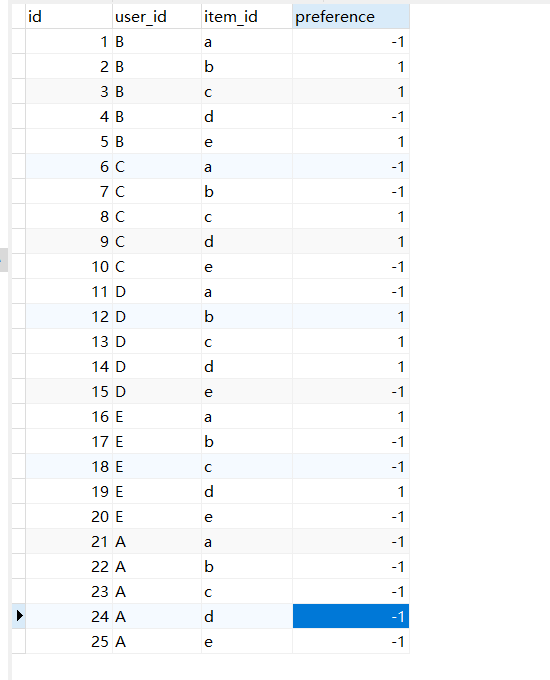

在这里：

**1表示**已经加入购物车并购买的商品

**-1表示**尚未购买，不确定用户是否喜欢的商品

初始状态下，A用户为选购任何商品

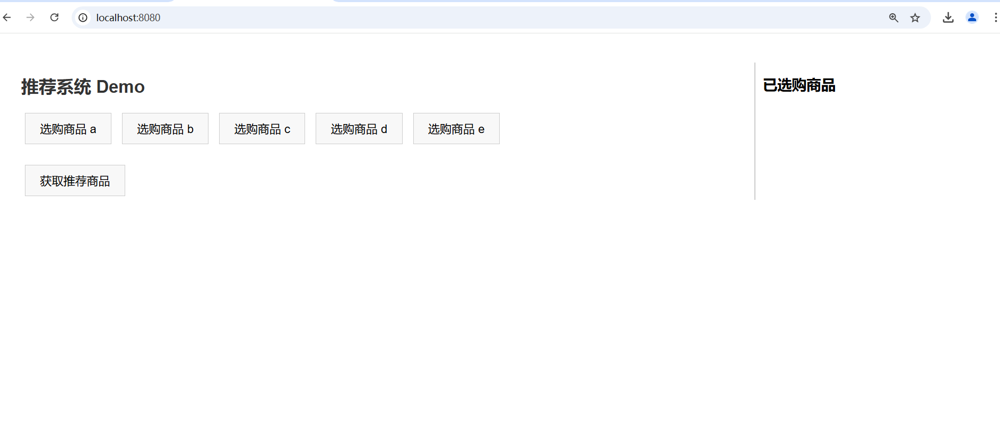

## 3.商品选购

点击选购一些商品

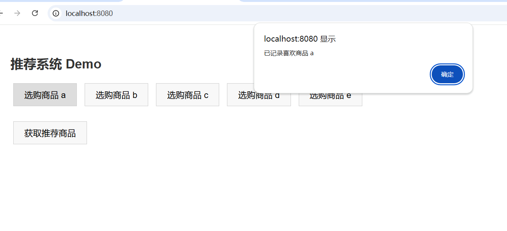

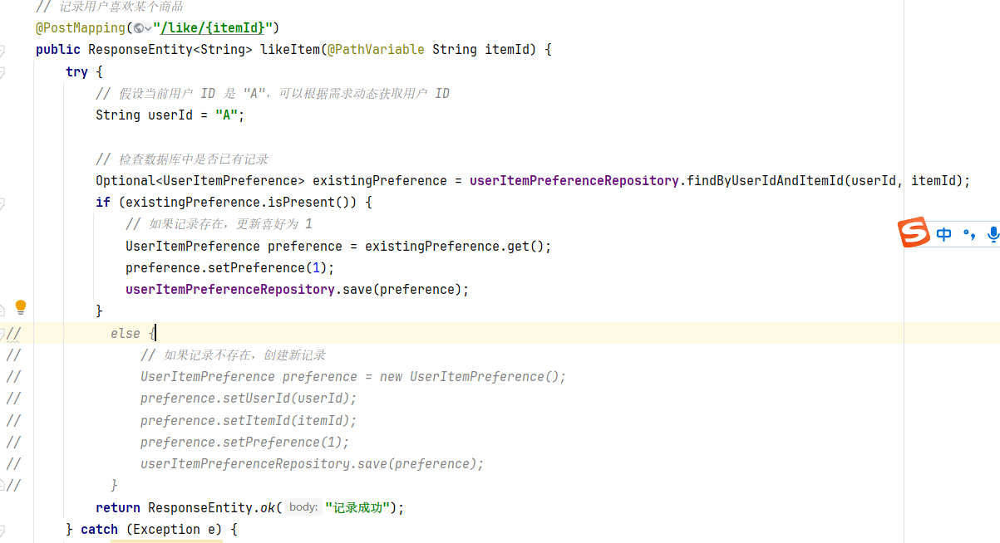

提示已记录

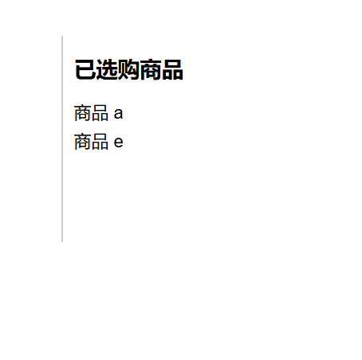

## 4.协同过滤算法计算

### 4.1 获取用户倒排表

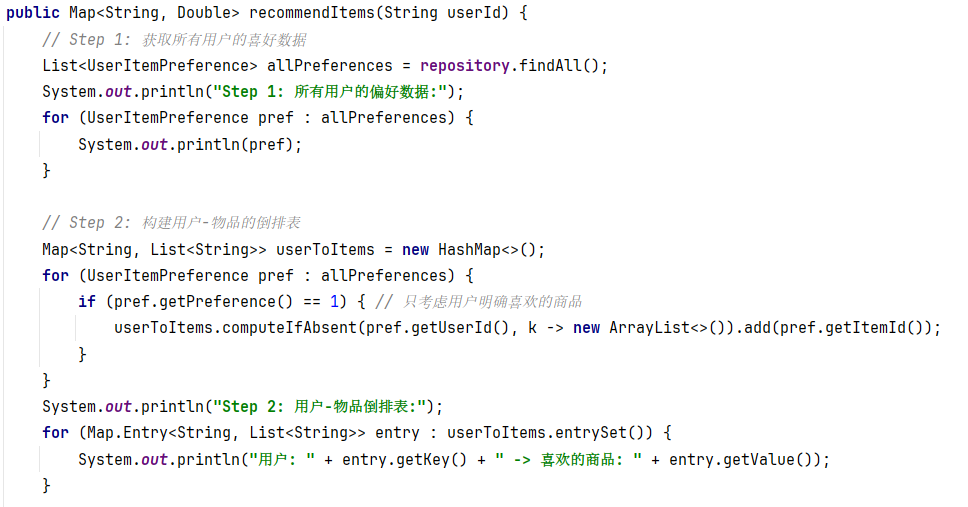

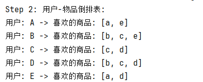

### 4.2 计算商品流行度

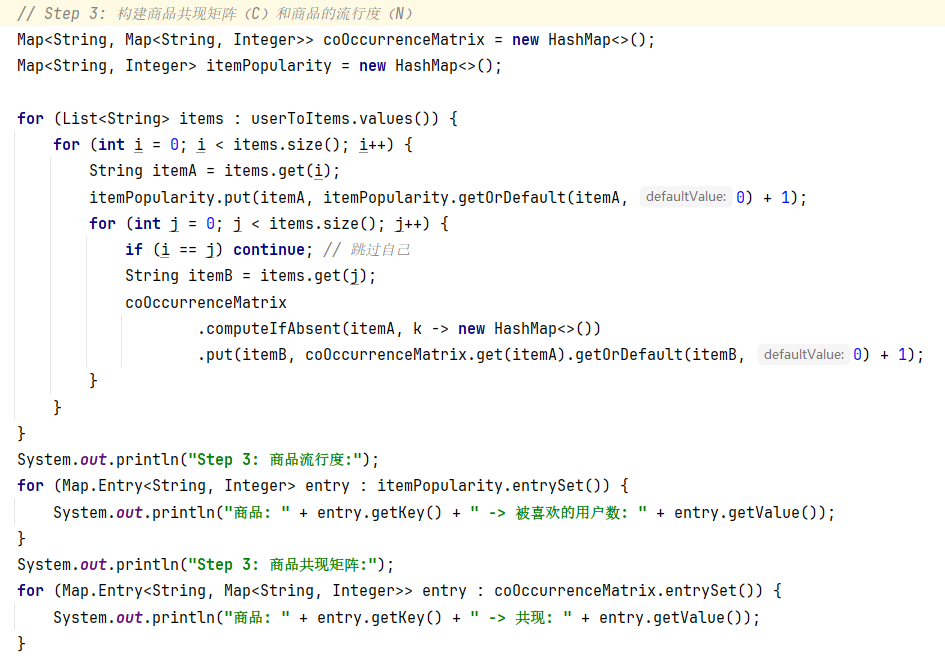

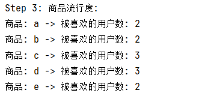

### 4.3 计算相似度矩阵

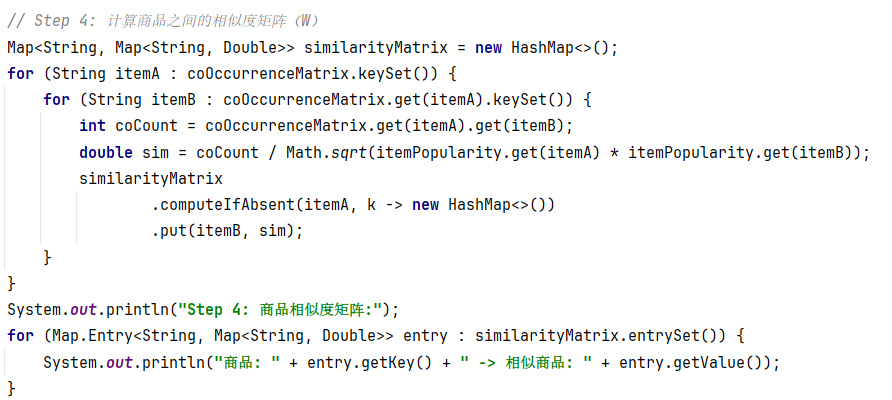

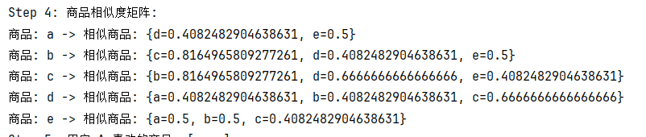

### 4.4 推荐排序

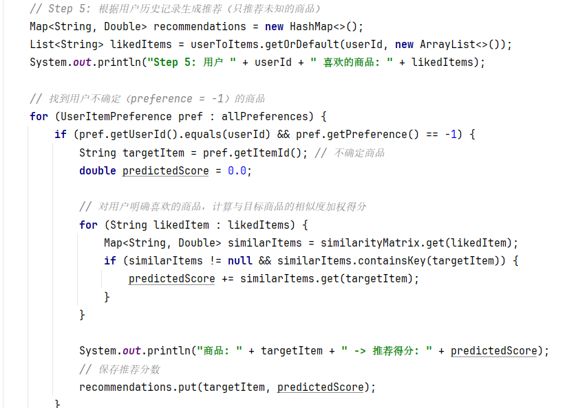

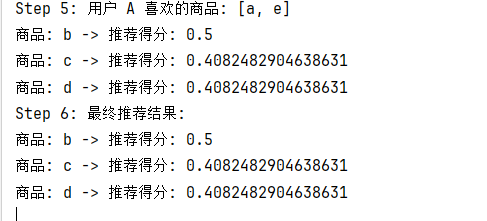

点击获取推荐商品按钮，获取推荐的顺序得分

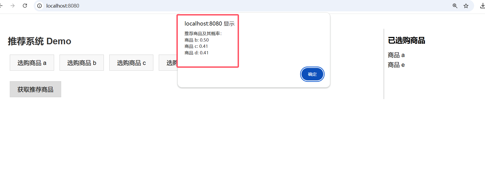

由此可见，最应该给用户A推荐的是**商品b**

