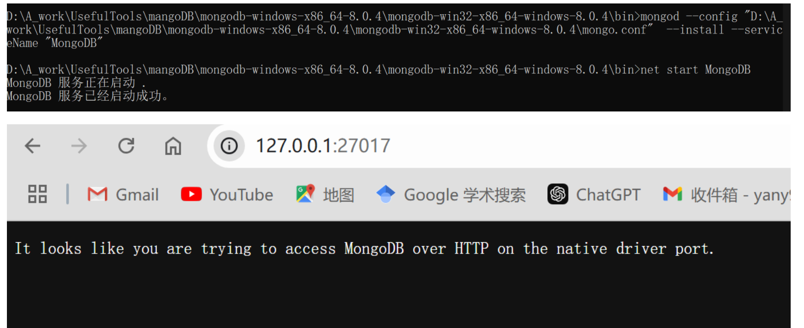
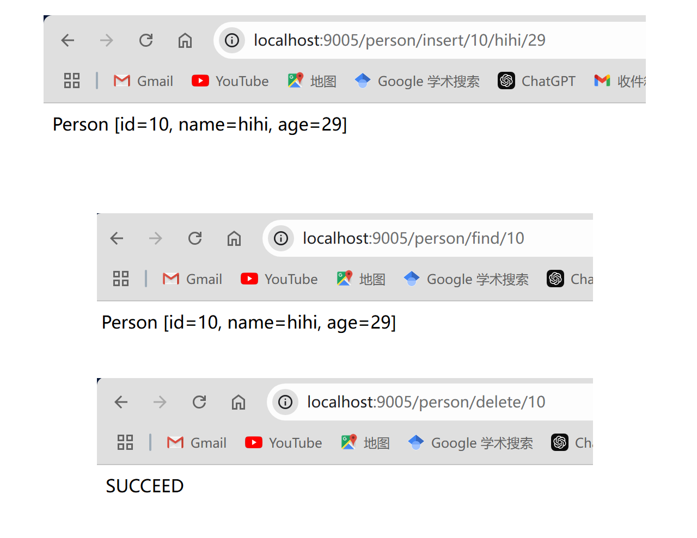

# Readme

## 配置mongodb并启动

[详细图解mongodb 3.4.1 win7x64下载、安装、配置与使用2017/01/16_windows7支持的mongoddb版本-CSDN博客](https://blog.csdn.net/qq_27093465/article/details/54574948)



## Maven集成mongo

[MongoDB实战：Java客户端整合MongoDB、SpringBoot整合MongoDB_java整合mongodb-CSDN博客](https://blog.csdn.net/qq_43631716/article/details/120251142)

### 导入依赖

```yaml
<?xml version="1.0" encoding="UTF-8"?>
<project xmlns="http://maven.apache.org/POM/4.0.0"
         xmlns:xsi="http://www.w3.org/2001/XMLSchema-instance"
         xsi:schemaLocation="http://maven.apache.org/POM/4.0.0 http://maven.apache.org/xsd/maven-4.0.0.xsd">
    <modelVersion>4.0.0</modelVersion>

    <groupId>org.example</groupId>
    <artifactId>mongo-demo</artifactId>
    <version>1.0-SNAPSHOT</version>

    <properties>
        <maven.compiler.source>17</maven.compiler.source>
        <maven.compiler.target>17</maven.compiler.target>
        <project.build.sourceEncoding>UTF-8</project.build.sourceEncoding>
    </properties>

    <parent>
        <groupId>org.springframework.boot</groupId>
        <artifactId>spring-boot-starter-parent</artifactId>
        <version>2.6.6</version>
        <relativePath/> <!-- lookup parent from repository -->
    </parent>


    <dependencies>
        <dependency>
            <groupId>org.springframework.boot</groupId>
            <artifactId>spring-boot-starter-data-mongodb</artifactId>
        </dependency>
        <dependency>
            <groupId>org.springframework.boot</groupId>
            <artifactId>spring-boot-starter-web</artifactId>
        </dependency>

        <dependency>
            <groupId>org.springframework.boot</groupId>
            <artifactId>spring-boot-starter-test</artifactId>
            <scope>test</scope>
        </dependency>
        <dependency>
            <groupId>org.projectlombok</groupId>
            <artifactId>lombok</artifactId>
            <version>1.18.16</version>
        </dependency>
    </dependencies>

    <build>
        <plugins>
            <plugin>
                <groupId>org.springframework.boot</groupId>
                <artifactId>spring-boot-maven-plugin</artifactId>
            </plugin>
        </plugins>
    </build>
    
</project>
```

### 配置mongo

```java
package org.example.conf;

import com.mongodb.client.MongoClient;
import com.mongodb.client.MongoClients;
import org.springframework.context.annotation.Bean;
import org.springframework.context.annotation.Configuration;
import org.springframework.data.mongodb.core.MongoTemplate;

@Configuration
public class AppConfig {

    public @Bean
    MongoClient mongoClient() {
        return MongoClients.create("mongodb://127.0.0.1:27017");
    }

    public @Bean
    MongoTemplate mongoTemplate() {
        return new MongoTemplate(mongoClient(), "order");
    }
}

```

### Demo实现

```java
package org.example.service;

import org.example.entity.Person;
import org.springframework.beans.factory.annotation.Autowired;
import org.springframework.data.mongodb.core.MongoTemplate;
import org.springframework.stereotype.Service;

import static org.springframework.data.mongodb.core.query.Criteria.where;
import static org.springframework.data.mongodb.core.query.Query.query;
import static org.springframework.data.mongodb.core.query.Update.update;

@Service
public class PersonService {
    @Autowired
    private MongoTemplate mongoOps;

    public String insert(String id, String name, Integer age){
        Person p = new Person(id,name, age);
        mongoOps.insert(p);
        System.out.println("Insert: " + p);
        return p.toString();
    }

    public Person find(String id){
        Person p = mongoOps.findById(id, Person.class);
        return  p;
    }

    public void delete(String id){
        Person p = find(id);
        mongoOps.remove(p);
    }

}

```

### 效果

