# 调研百度api，并思考如何应用到收货地址保存功能

### 1.尝试使用Spring Initializr初始化构建代码

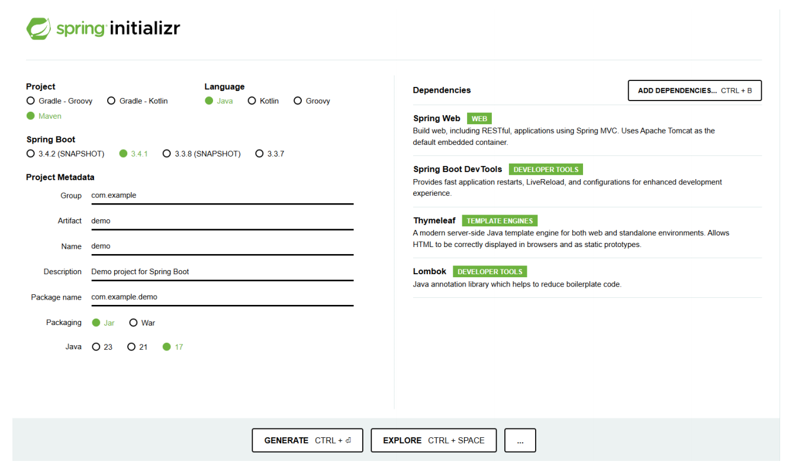

## 1.扩展—高德地图api

由于在百度地图开放平台的申请需要审核三个工作日，且我们申请的时候恰逢周六。**为了能不耽误进度**，我们选择先使用高德地图api进行探究。

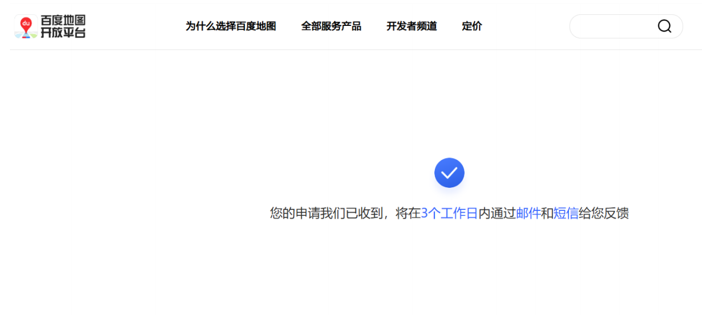

首先，在控制台创建一个新的应用

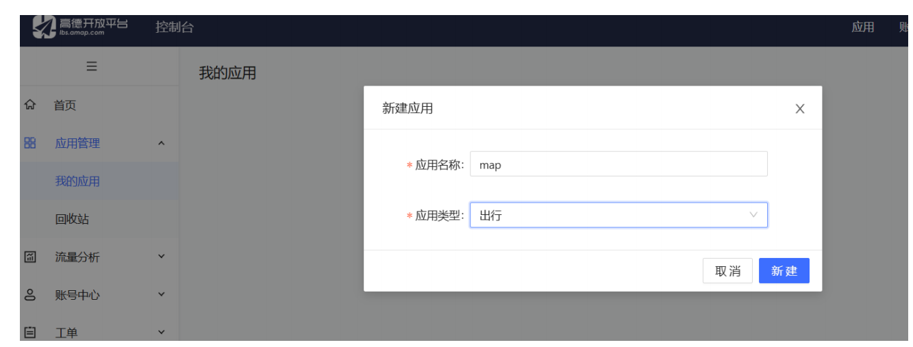

为map应用添加key。值得注意的是，这里需要构建**两个不用的key！**

1.首先是需要进行前端展示的key：dev

其选择的服务平台是“Web端（JS API）

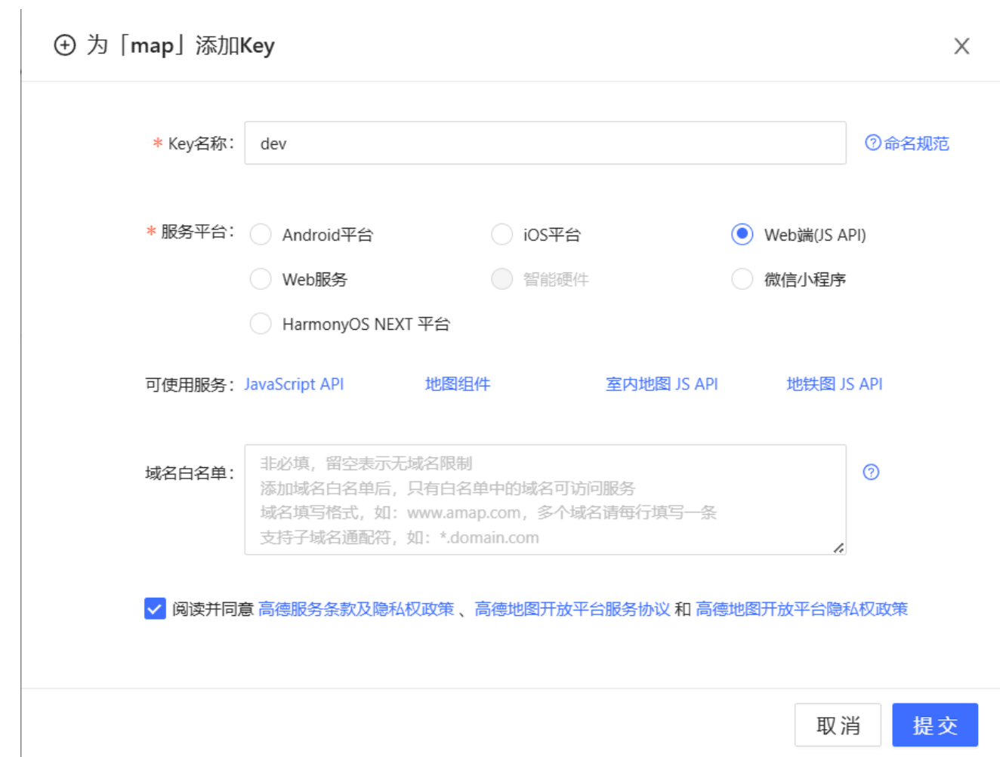

2.之后则是后端的key：dev1

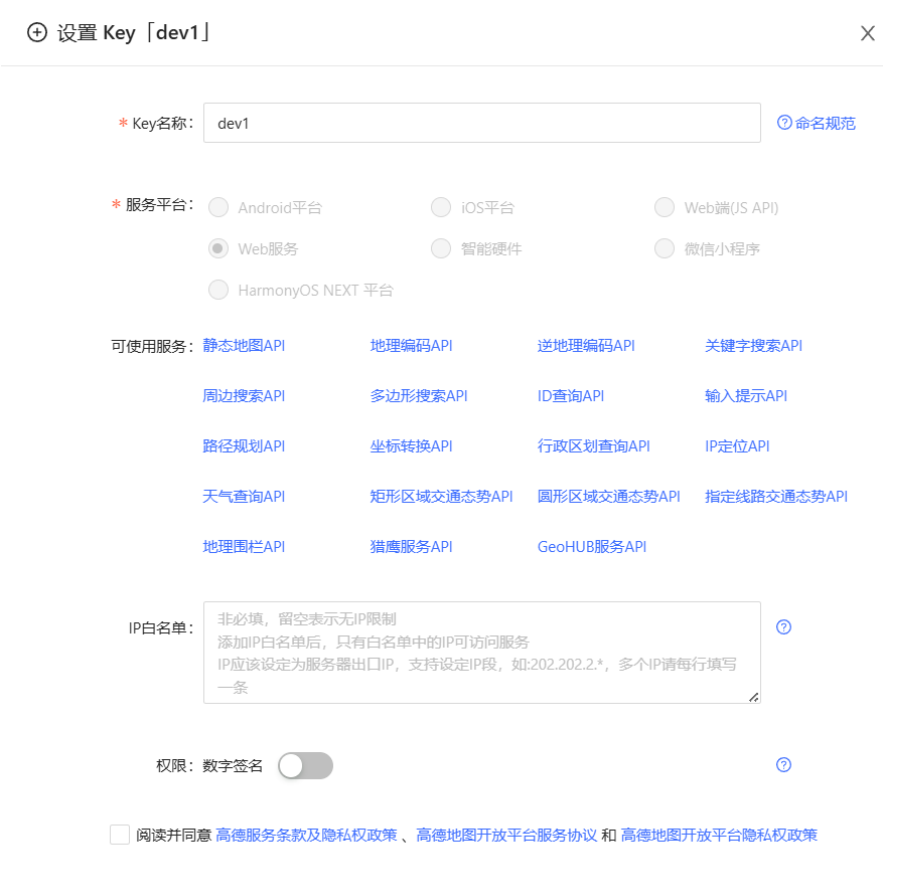

至此，我们获得了两个不同的key值和安全密钥

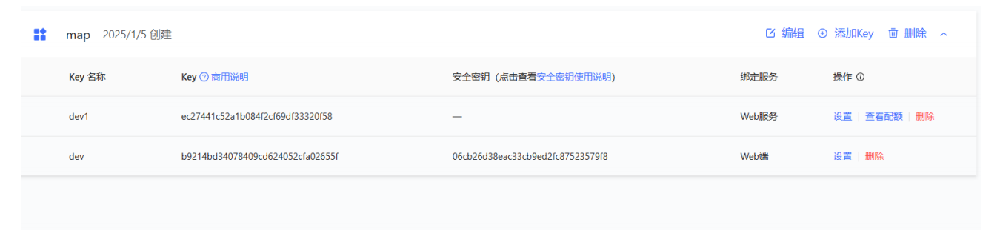

## 1.1 基本配置代码详情

1.application配置

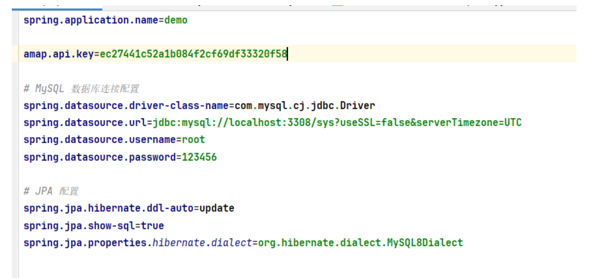

由于我们需要完成老师要求的“**收货地址保存**”，因此在这里我们连接了数据库

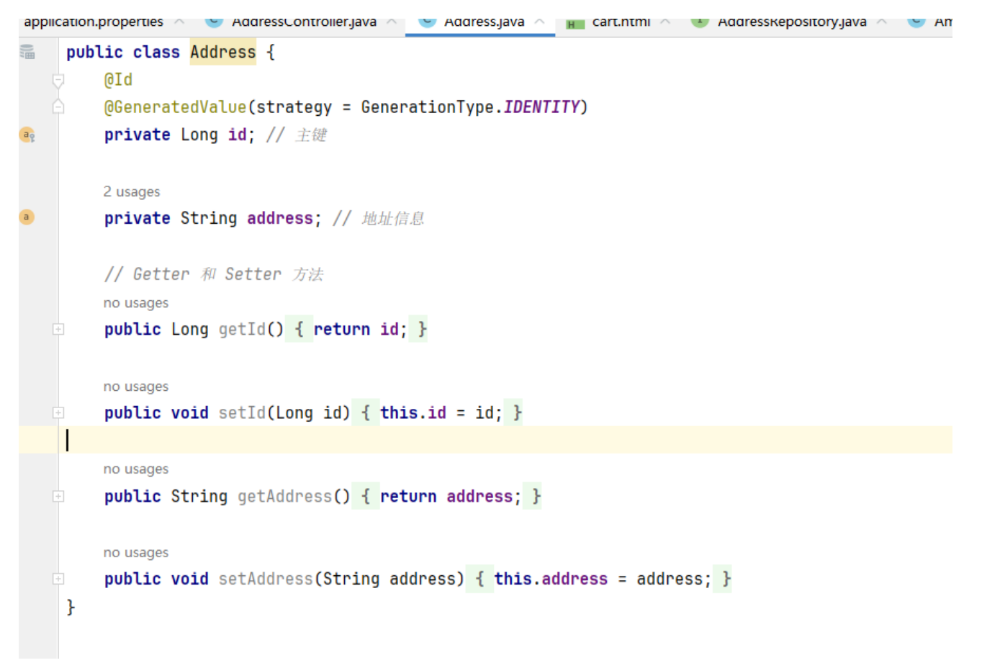

后端的key：

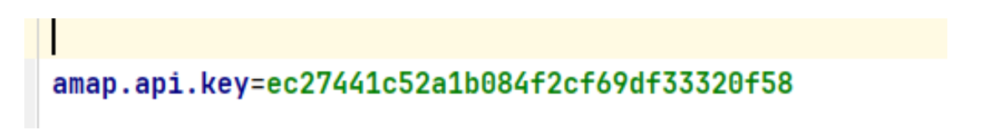

在前端，我们按照高德地图api的官方文档配置:

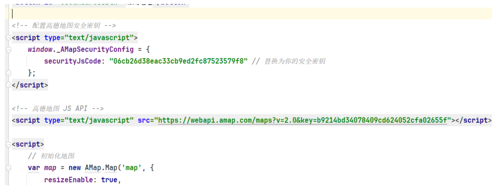

效果如下：

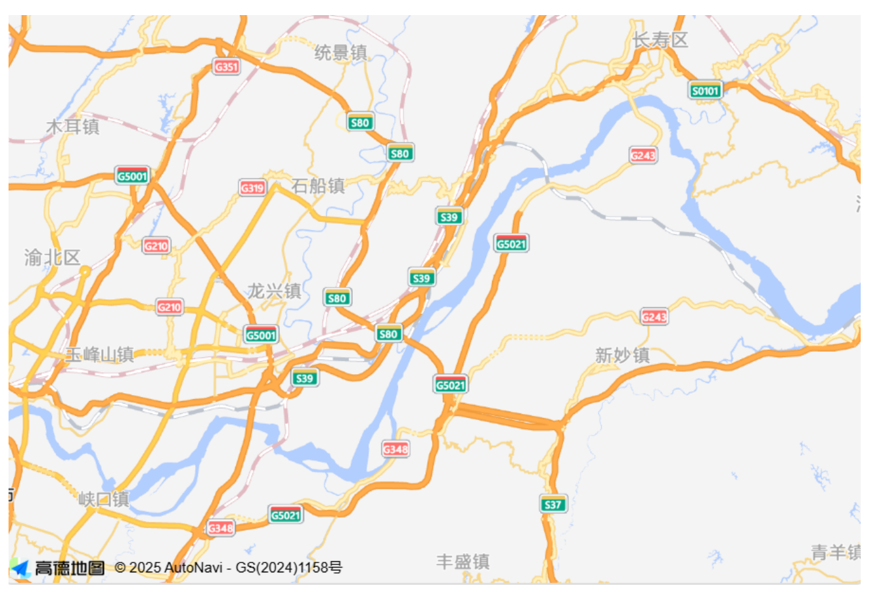

## 1.2 点击地图获取经纬度&地名

高德地图map.on监听地图上的点击时间

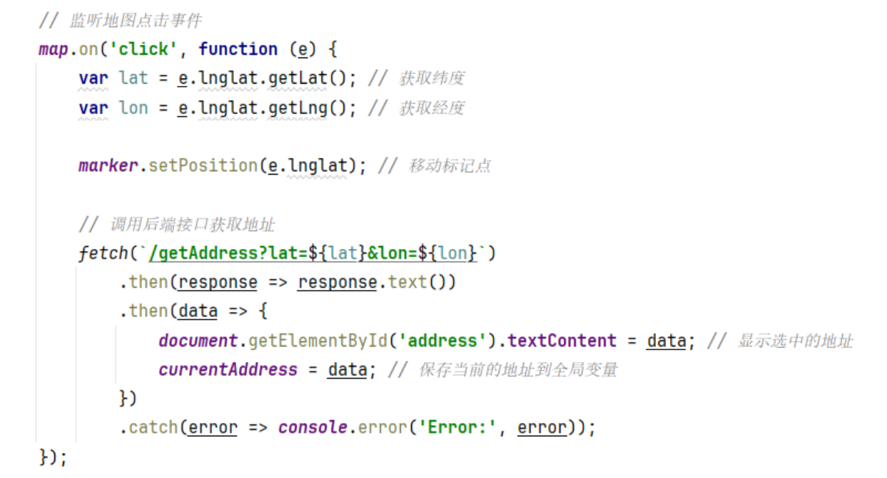

返回经纬度

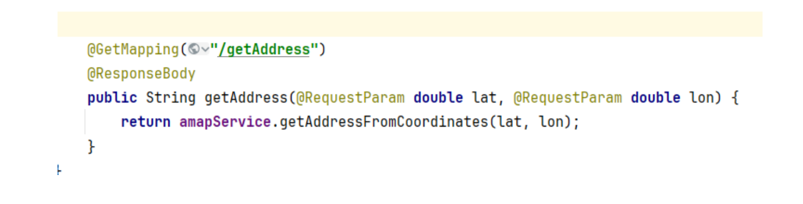

## 1.3 将选中的地址存入本地mysql数据库

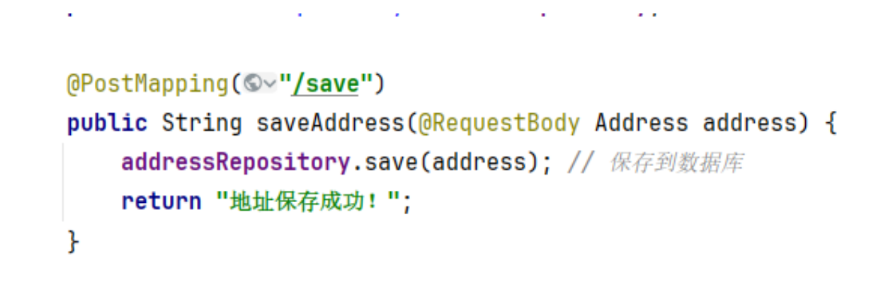

## 1.4 从本地mysql数据库查询常用地址

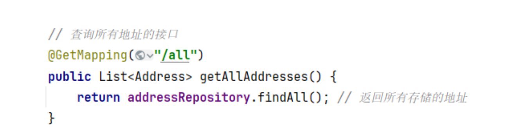

## 1.5 效果展示

### 1.5.1 首页

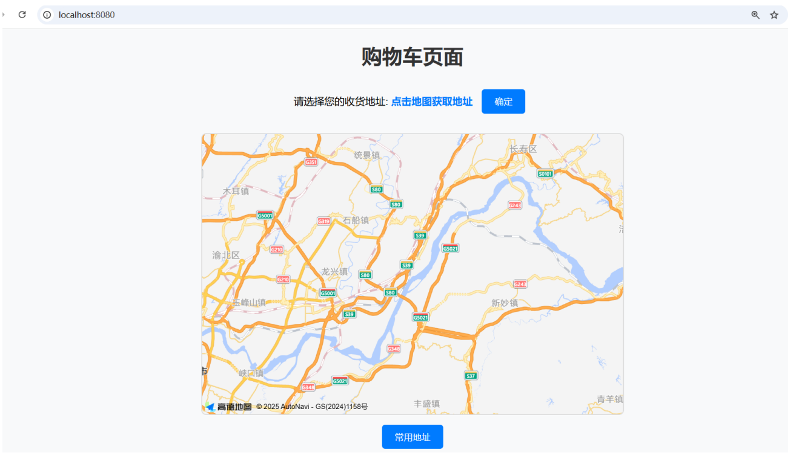

### 1.5.2 点击任意位置并保存

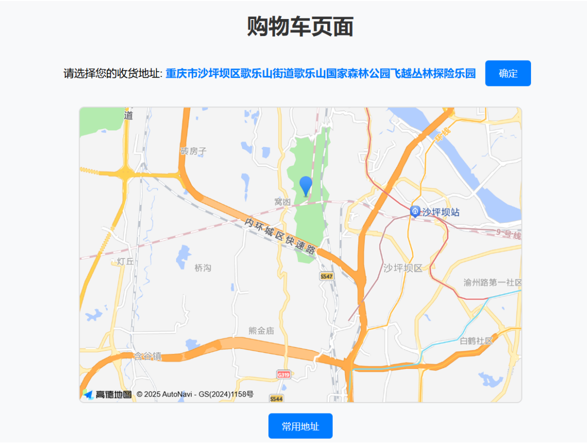

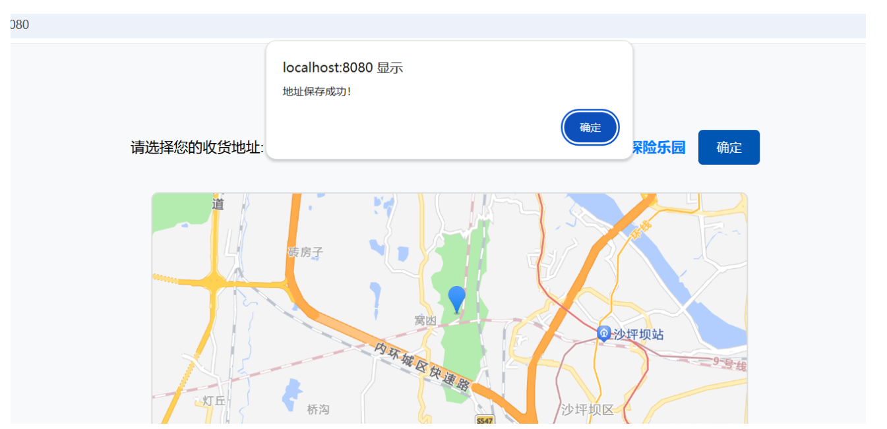

数据库中成功添加

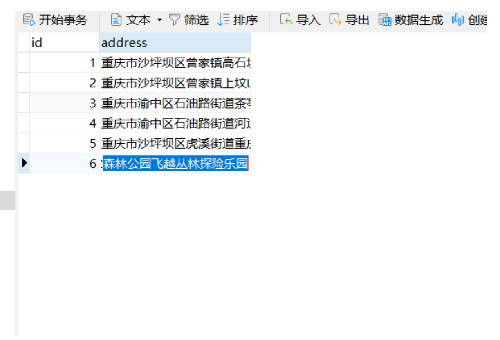

### 1.5.3 查询常用地址

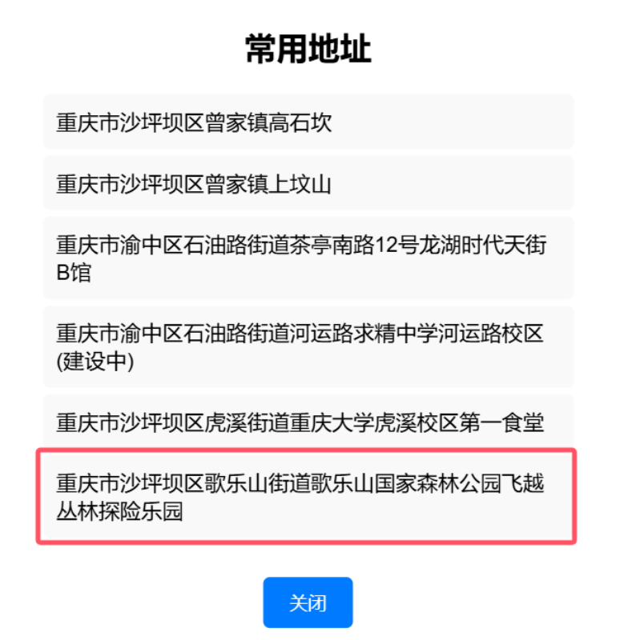

